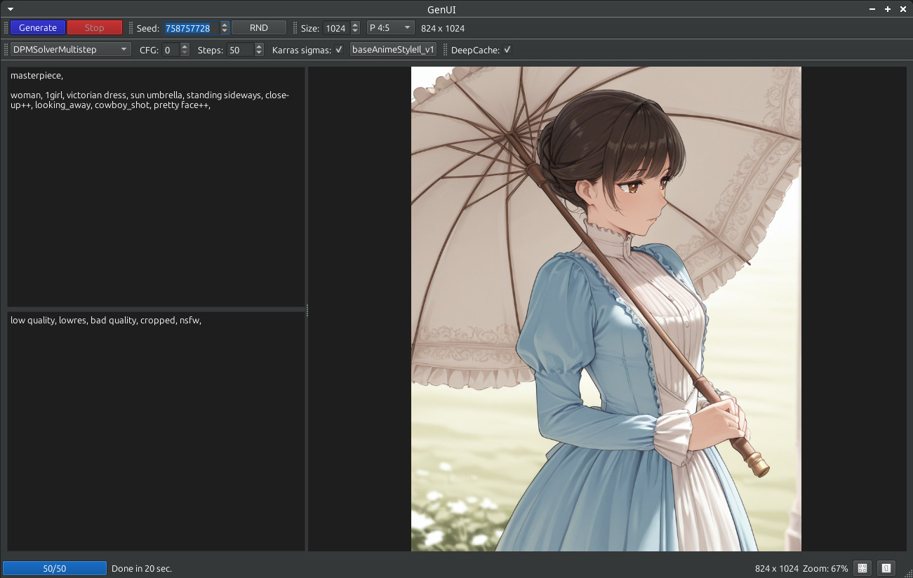

# GenUI

This project is a **desktop UI** application designed to simplify and enhance the process of generating images using **Stable Diffusion**. Whether you're an artist, designer, or just someone exploring AI-generated art, this tool provides an intuitive interface to create stunning visuals with ease.



Key Features:

- **User-Friendly Interface:** A clean and simple design that makes image generation accessible to users of all skill levels.
- **Customizable Parameters:** Fine-tune your image generation with options for prompts, sampling methods, steps, and more.
- **Image Preview:** Preview generated images in real-time to ensure they meet your expectations.
- **Progress Tracking:** Monitor the progress of your image generation in real-time.
- **Automatic Image Saving:** Images are automatically saved to a designated folder for easy access and sharing.

For a detailed overview of **important changes, updates, and releases**, please refer to the **[CHANGELOG](./CHANGELOG.md)** file. This document provides a comprehensive history of significant developments in the project.

## :exclamation: Disclaimer

This project is a just-for-fun initiative. While I am a professional developer, I am not an AI engineer or a scientist. The application is provided "as-is," and I make no guarantees regarding its accuracy, performance, or suitability for any specific purpose. Use it at your own discretion!

This documentation has been created with the assistance of AI tools, including [DeepSeek](https://chat.deepseek.com), as part of an experiment and personal research effort. While every effort has been made to ensure accuracy and clarity, please note that the content may contain imperfections or require further refinement. If you spot any errors or have suggestions for improvement, feel free to contribute or reach out!

## Why Use This Tool?

This application bridges the gap between advanced AI models and everyday users, making it easier than ever to experiment with AI-generated art. Whether you're creating concept art, exploring creative ideas, or just having fun, this tool empowers you to bring your vision to life.

Built With:
- Python: Core logic and backend.
- PyQt6: Desktop UI framework.
- Stable Diffusion: AI model for image generation.
- Hugging Face Diffusers: Integration with the Stable Diffusion pipeline.

Feel free to [contribute](https://github.com/FRiMN/GenUI/pulls), [report issues](https://github.com/FRiMN/GenUI/issues), or [suggest new features](https://github.com/FRiMN/GenUI/issues)! Let's make AI art creation more accessible and enjoyable for everyone.

## Installation Guide

We support two methods for installation: **pipx** and **uv**.

Before installing, choose release version and [tag](https://github.com/FRiMN/GenUI/tags).

### Pipx

Follow the instructions on the [pipx website](https://pipx.pypa.io/stable/installation/) to install pipx.

Then, install chosen version of GenUI using pipx:

```bash
pipx install git+https://github.com/FRiMN/GenUI.git@v2025.3.0
```

After installation, you can run GenUI from the command line:

```bash
genui
```

### Uv

Follow the instructions on [Astral's website](https://docs.astral.sh/uv/getting-started/installation/) to install uv.

Then, [install](https://docs.astral.sh/uv/guides/tools/#installing-tools) chosen version of GenUI using uv:

```bash
uv tool install git+https://github.com/FRiMN/GenUI.git@v2025.3.0
```

After installation, you can run GenUI from the command line:

```bash
genui
```

## Configuration

See [docs/settings.md](docs/settings.md) for details on how to configure GenUI.

## Prompt Syntax Guide

GenUI supports advanced prompt syntax including weight adjustment with parentheses and the BREAK keyword for combining concepts. See the **[Prompt Syntax Guide](docs/prompt-syntax-guide.md)** for complete usage instructions.
